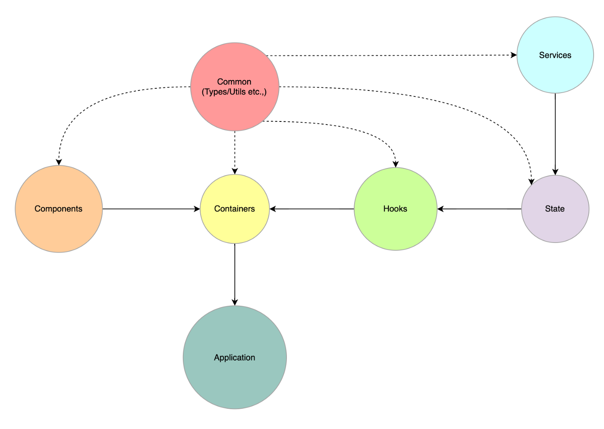

### `Below is a picture of how the modules point and should point to each other`

**Note: Every arrowhead in the diagram above represents an import statement.**
**https://jsonplaceholder.typicode.com/posts is used as mock api for this example**

### Application

The application/root module is simply the collection/composition of containers(a.k.a smart components). It's responsible for bootstrapping the application with react-suspense, error-boundaries and any top-level providers. In general, it should contain as very minimal code as possible.

### Containers

The containers module is a collection of smart components that are connected to the state via the hooks. As you can see that the containers modules only import common, components and hooks modules and it doesn’t concern the state module at all. This helps us to scale the hooks module without affecting the states.

### Hooks

The hooks module supplies data to the containers through the state and also updates the state based on the user interaction with the container components.

### State

The state module is responsible for populating the client-side state using the service and common modules. This enables us to avoid polluting the containers and hooks with service APIs.

### Components

The components module is just a collection of purely functional components that do not care about the application state.

Although this could be purely independent like an external library, you might still end up building application-specific components that closely resemble the data types from the common module. Hence it's often helpful to isolate/mark generic and specific components. Generic components do not use any types from the common modules, thereby enabling us to move them to an external component library.

### Services

Services modules form the collection of APIs that interact with the backend and the resulting response should align with the core data types present in our common modules.

# create-react-app

## Available Scripts

In the project directory, you can run:

### `npm start`

Runs the app in the development mode.\
Open [http://localhost:3000](http://localhost:3000) to view it in the browser.

The page will reload if you make edits.\
You will also see any lint errors in the console.

### `npm test`

Launches the test runner in the interactive watch mode.\
See the section about [running tests](https://facebook.github.io/create-react-app/docs/running-tests) for more information.

### `npm run build`

Builds the app for production to the `build` folder.\
It correctly bundles React in production mode and optimizes the build for the best performance.

The build is minified and the filenames include the hashes.\
Your app is ready to be deployed!

See the section about [deployment](https://facebook.github.io/create-react-app/docs/deployment) for more information.

### `npm run eject`

**Note: this is a one-way operation. Once you `eject`, you can’t go back!**

If you aren’t satisfied with the build tool and configuration choices, you can `eject` at any time. This command will remove the single build dependency from your project.

Instead, it will copy all the configuration files and the transitive dependencies (webpack, Babel, ESLint, etc) right into your project so you have full control over them. All of the commands except `eject` will still work, but they will point to the copied scripts so you can tweak them. At this point you’re on your own.

You don’t have to ever use `eject`. The curated feature set is suitable for small and middle deployments, and you shouldn’t feel obligated to use this feature. However we understand that this tool wouldn’t be useful if you couldn’t customize it when you are ready for it.
